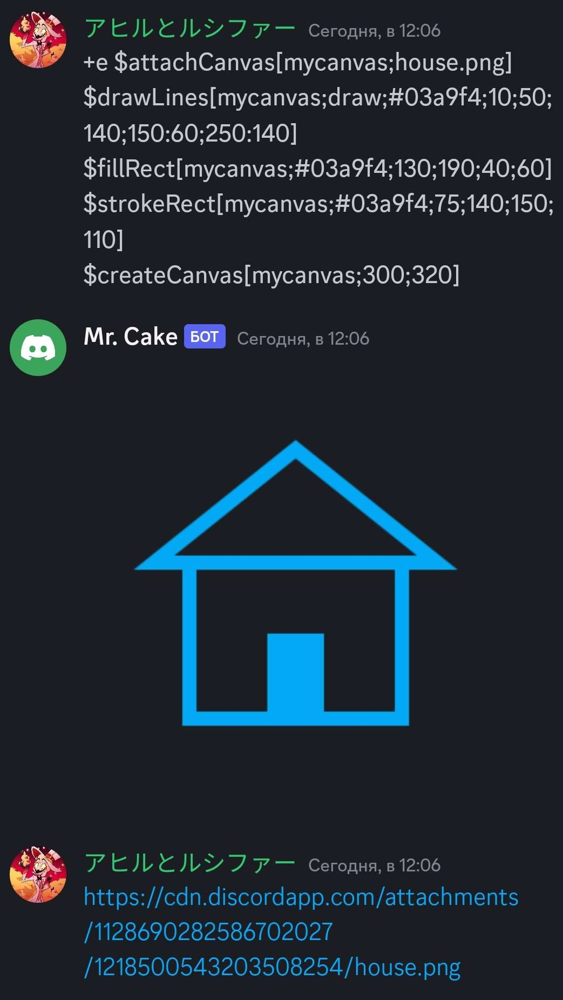
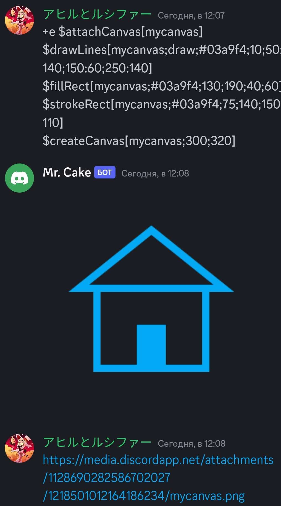

Attaches canvas.

## Usage

```
$attachCanvas[canvas;name?]
```

## Parameters

| Field  | Description                                              | Type   | Required |
| ------ | -------------------------------------------------------- | ------ | -------- |
| canvas | The canvas name.                                         | string | true     |
| name   | The attachment name. (format included, for example .png) | string | false    |

## Example(s)

### This will create new 300x320 canvas with house and add an attachment house.png.

```
$attachCanvas[mycanvas;house.png]
$drawLines[mycanvas;draw;#03a9f4;10;50;140;150:60;250:140]
$fillRect[mycanvas;#03a9f4;130;190;40;60]
$strokeRect[mycanvas;#03a9f4;75;140;150;110]
$createCanvas[mycanvas;300;320]
```



### This will create new 300x320 canvas with house and add an attachment with name of your canvas. (mycanvas.png)

```
$attachCanvas[mycanvas]
$drawLines[mycanvas;draw;#03a9f4;10;50;140;150:60;250:140]
$fillRect[mycanvas;#03a9f4;130;190;40;60]
$strokeRect[mycanvas;#03a9f4;75;140;150;110]
$createCanvas[mycanvas;300;320]
```


