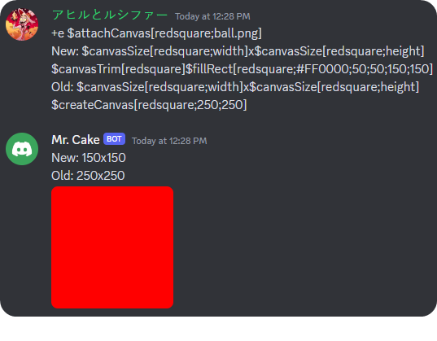

Returns canvas size.

## Usage

```
$canvasSize[canvas;property]
```

## Parameters

| Field    | Description               | Type                | Required |
| -------- | ------------------------- | ------------------- | -------- |
| canvas   | The canvas name.          | string              | true     |
| property | The canvas size property. | "width" \| "height" | true     |

## Example(s)

### This will create a redsquare canvas and then send it with the old and after trimming size.

```
$attachCanvas[redsquare;ball.png]
New: $canvasSize[redsquare;width]x$canvasSize[redsquare;height] $canvasTrim[redsquare]$fillRect[redsquare;#FF0000;50;50;150;150]
Old: $canvasSize[redsquare;width]x$canvasSize[redsquare;height]
$createCanvas[redsquare;250;250]
```


