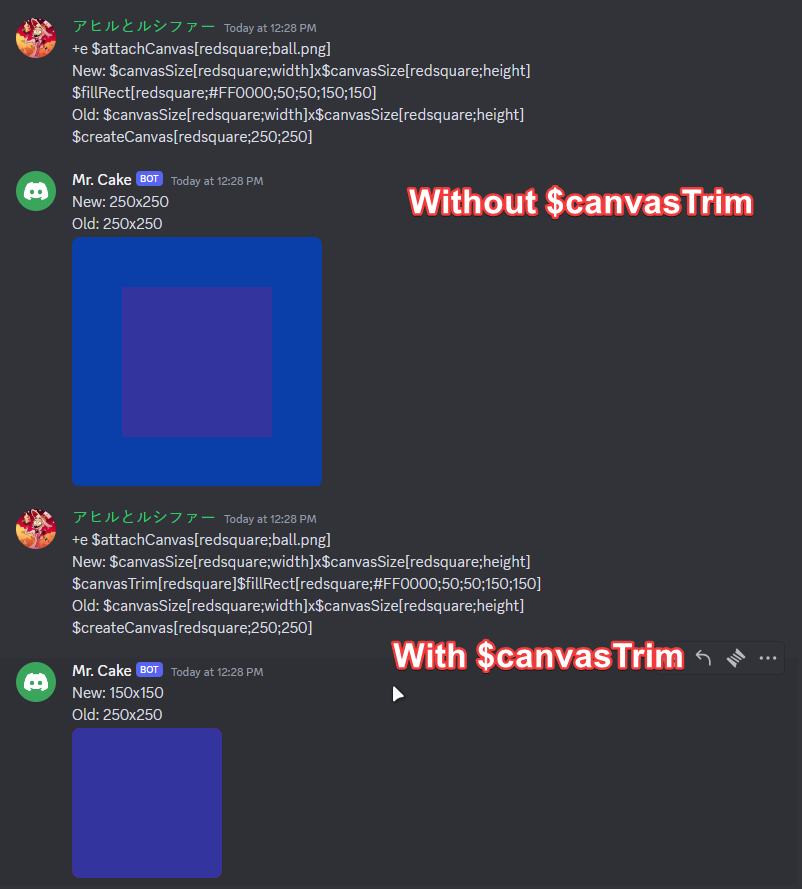

Trims the canvas.

## Usage

```
$canvasTrim[canvas]
```

## Parameters

| Field  | Description      | Type   | Required |
| ------ | ---------------- | ------ | -------- |
| canvas | The canvas name. | string | true     |

## Example(s)

### This will draw a red square and then trim the canvas

```
$attachCanvas[redsquare;ball.png]
New: $canvasSize[redsquare;width]x$canvasSize[redsquare;height] $canvasTrim[redsquare]$fillRect[redsquare;#FF0000;50;50;150;150]
Old: $canvasSize[redsquare;width]x$canvasSize[redsquare;height]
$createCanvas[redsquare;250;250]
```


