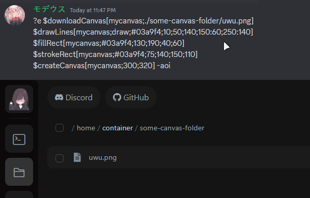

Downloads the canvas.

## Usage

```
$downloadCanvas[canvas;path]
```

## Parameters

| Field  | Description                                      | Type   | Required |
| ------ | ------------------------------------------------ | ------ | -------- |
| canvas | The canvas name.                                 | string | true     |
| path   | The download path. (file name and extension too) | string | true     |

## Example(s)

### This will create a house canvas and then download it into a directory.

```
$downloadCanvas[mycanvas;./some-canvas-folder/uwu.png]
$drawLines[mycanvas;draw;#03a9f4;10;50;140;150:60;250:140]
$fillRect[mycanvas;#03a9f4;130;190;40;60]
$strokeRect[mycanvas;#03a9f4;75;140;150;110]
$createCanvas[mycanvas;300;320]
```


