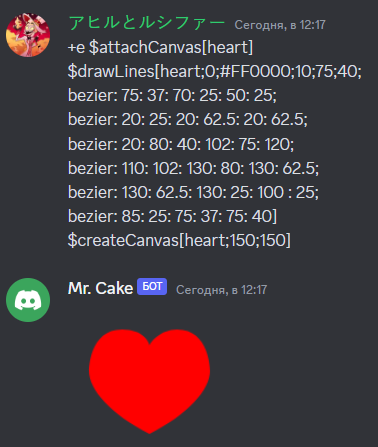

Draws lines.

## Usage

```
$drawLines[canvas;type;color;strokeWidth?;x?;y?;...lines]
```

## Parameters

| Field       | Description                                                                                                              | Type      | Required |
| ----------- | ------------------------------------------------------------------------------------------------------------------------ | --------- | -------- | ---- |
| canvas      | The canvas name.                                                                                                         | string    | true     |
| type        | The action type. (0 = fill                                                                                               | 1 = draw) | number   | true |
| color       | The lines/fill color.                                                                                                    | color     | true     |
| strokeWidth | The lines width.                                                                                                         | number    | false    |
| x           | The lines start X position.                                                                                              | number    | false    |
| y           | The lines start Y position.                                                                                              | number    | false    |
| ...lines    | The lines. (x:y / move:x:y / bezier:controlX:controlY:centerX2:centerY2:endX:endY / quadric:controlX:controlY:endX:endY) | string    | true     |

## Example(s)

### This will create new 300x320 canvas with house and add an attachment house.png.

```
$attachCanvas[mycanvas;house.png]
$drawLines[mycanvas;draw;#03a9f4;10;50;140;150:60;250:140]
$fillRect[mycanvas;#03a9f4;130;190;40;60]
$strokeRect[mycanvas;#03a9f4;75;140;150;110]
$createCanvas[mycanvas;300;320]
```


### This will create new 150x150 canvas with name heart and draw heart on it using bezier curve/lines

```
$attachCanvas[heart]
$drawLines[heart;0;#FF0000;10;75;40;
bezier: 75: 37: 70: 25: 50: 25;
bezier: 20: 25: 20: 62.5: 20: 62.5;
bezier: 20: 80: 40: 102: 75: 120;
bezier: 110: 102: 130: 80: 130: 62.5;
bezier: 130: 62.5: 130: 25: 100 : 25;
bezier: 85: 25: 75: 37: 75: 40]
$createCanvas[heart;150;150]
```


